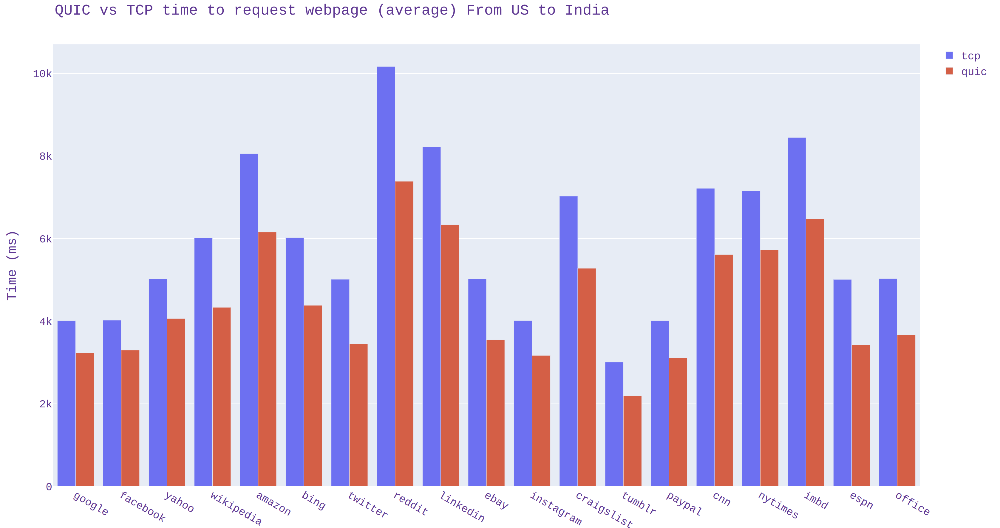
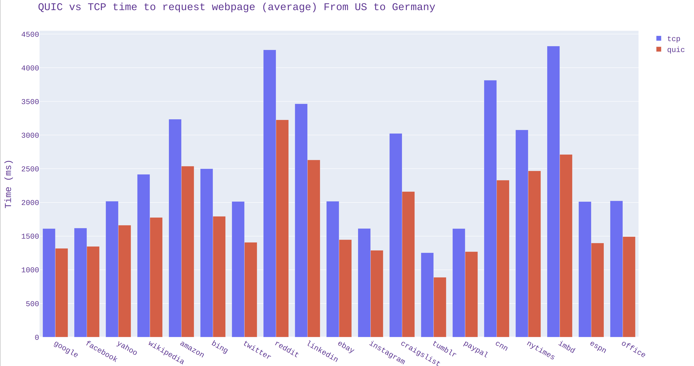
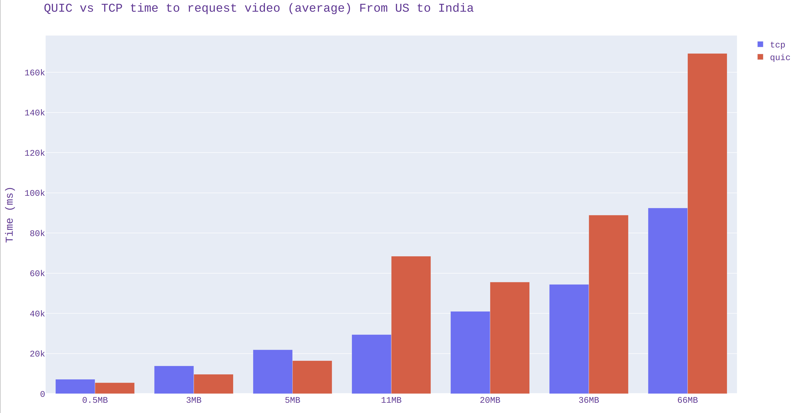
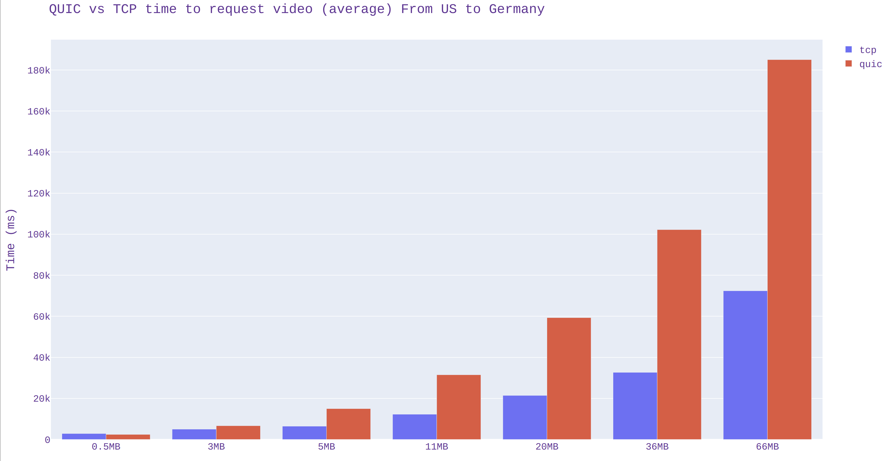
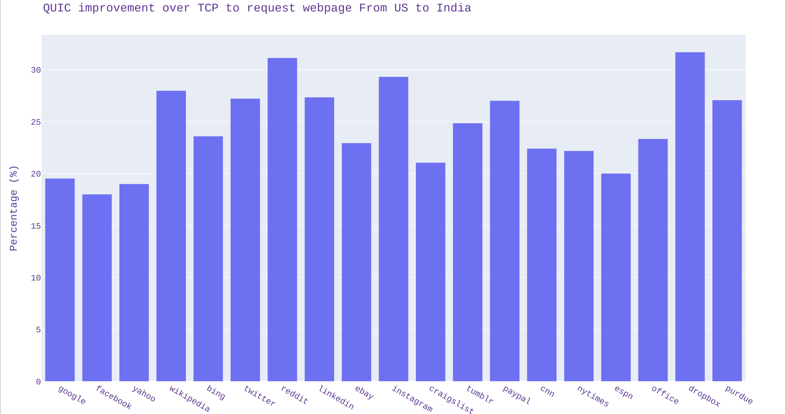
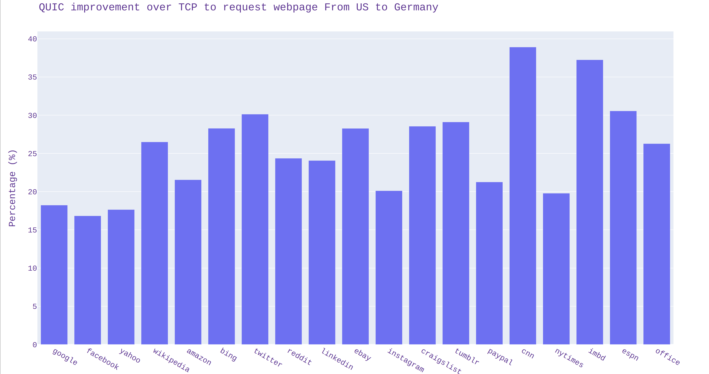
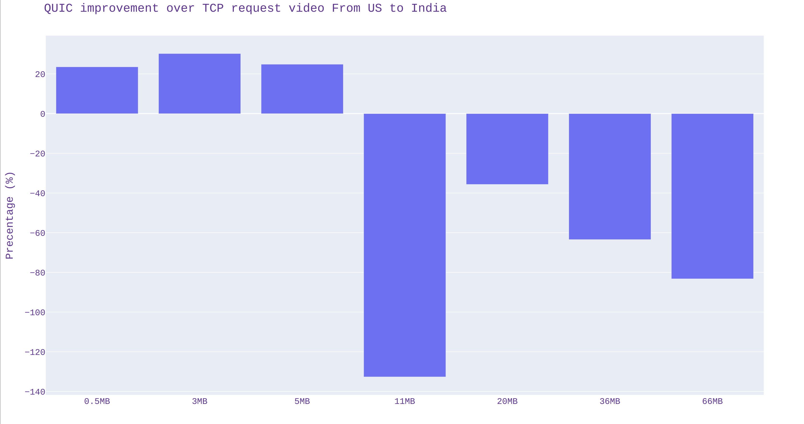
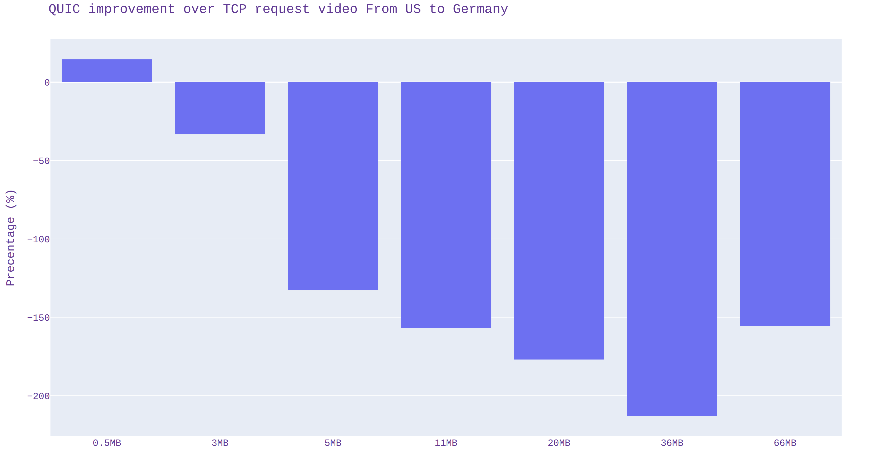

# Plots for all
## 0. External Library
all figures are ploted with [[plotly]](https://plotly.com/python/)
## 1. Data
all the data generated by TCP/QUIC are in "data" folder
## 2. Performance Plots
all the plots for data analysis are in "plots" folder
### 2.1 QUIC vs TCP time to request webpage (std) From US to India

### 2.2 QUIC vs TCP time to request webpage (std) From US to Germany

### 2.1 QUIC vs TCP time to request video (std) From US to India

### 2.2 QUIC vs TCP time to request video (std) From US to Germany

## 3. Improvement Plots
### 3.1 QUIC improvement over TCP request webpage From US to India

### 3.2 QUIC improvement over TCP request webpage From US to Germany

### 2.1 QUIC improvement over TCP request video From US to India

### 3.2 QUIC improvement over TCP request video From US to Germany
